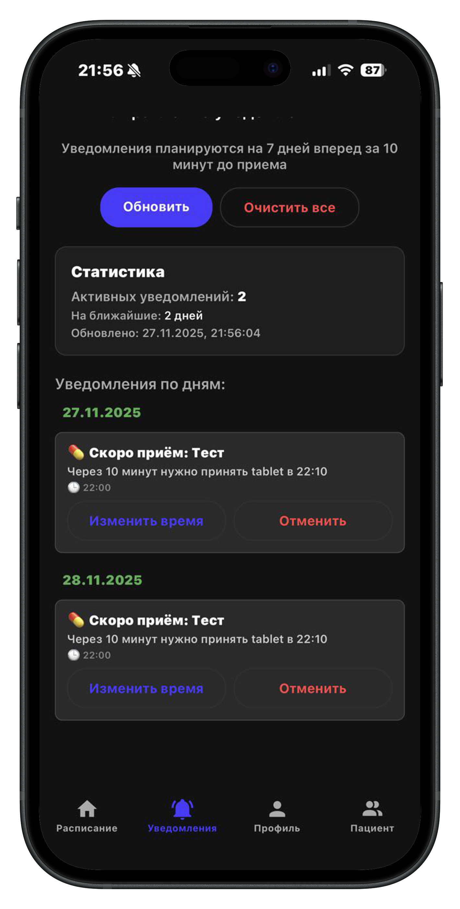

# 📱 Мобильное приложение «МАИ таблетки»

Приложение **«МАИ таблетки»** — это инструмент для поддержки регулярного приёма лекарств, ведения личного журнала терапии и организации безопасного наблюдения со стороны доверенных лиц (мед-друзей).
Сервис ориентирован на пользователей любого возраста и предоставляет понятный механизм контроля медикаментозного курса.

---

# 1. 🧾 Формирование курса терапии

## ➤ Добавление рецепта

Чтобы создать новый рецепт:

1. Перейдите во вкладку **«Рецепты»**.
2. Нажмите **«Добавить рецепт»**.
3. Укажите:

   * название препарата;
   * форму выпуска (таблетки, капли, спрей и др.);
   * тип расписания (ежедневно, раз в *N* дней);
   * время приёма (одно или несколько в течение дня);
   * комментарий (по желанию).

## ➤ Типы препаратов

Поддерживаются различные формы:

* таблетки;
* капли;
* спрей;
* другие виды форм.

Тип влияет только на удобство отображения и подсказки для пользователя.

## ➤ Комментарии

К рецепту можно добавить текстовые примечания:

* назначение врача;
* рекомендации по приёму (до еды / после еды);
* наблюдения о переносимости препарата.

## ➤ Расписания приёма

Доступные варианты:

* **ежедневно** — фиксированный набор времени на каждый день;
* **раз в N дней** — например, через каждые 2 или 3 дня.

Можно указывать несколько точек приёма в сутки (например, «08:00» и «20:00»).

## ➤ Удаление рецепта

1. Откройте нужный рецепт.
2. Выберите **«Удалить рецепт»**.
3. Подтвердите действие.

---

# 2. 📘 Ведение журнала приёмов

Приложение автоматически формирует **журнал приёмов**, где пользователь отмечает:

* ✔️ факт приёма;
* ❌ пропуск дозы;
* 🕒 фактическое время приёма (если отличается от расписания).

Журнал позволяет отслеживать динамику и обнаруживать пропуски.

---

# 3. 🔔 Уведомления

За 10 минут до каждого запланированного приёма приложение отправляет напоминание о необходимости принять лекарство.

Параметры уведомлений можно изменять или полностью отключить в настройках.

---

# 4. 👥 Подключение мед-друга

**Мед-друг** — это доверенное лицо (родственник, помощник, опекун), которое получает доступ к расписанию, рецептам и истории приёмов пациента.

## ➤ Как подключить мед-друга

### На устройстве мед-друга:

1. Откройте вкладку **«Профиль»**.
2. Нажмите **«Сгенерировать код приглашения»**.
3. Покажите QR-код или передайте текстовый код пациенту.
   (Срок действия кода — **3 минуты**.)

### На устройстве пациента:

1. Перейдите в **«Пациент»** → **«Подключить мед-друга»**.
2. Введите полученный код или отсканируйте QR-код.

После успешного подключения рекомендуется **перезапустить приложение** у обеих сторон для обновления данных.

## ➤ Просмотр подключённых пользователей

Раздел **«Профиль»** содержит:

* список моих мед-друзей;
* список пациентов, за которыми я наблюдаю.

---

# 5. 🔄 Оффлайн-режим и синхронизация

Приложение может работать **полностью офлайн**.
При появлении интернета выполняется автоматическая синхронизация:

* рецептов;
* расписаний приёма;
* журнала приёмов;
* данных подключений.

Это делает приложение удобным для пользователей с ограниченным доступом к сети.

---

# 6. 🔐 Медицинская тайна и безопасность

Мы уделяем особое внимание защите персональных данных:

* подключение мед-друга выполняет **только сам пациент**;
* данные, передаваемые на сервер, **обезличены**;
* пациент может **отозвать доступ** в любой момент;
* приложение не передаёт данные третьим лицам.

---

# 7. 🧭 Диаграмма прецедентов (Use Case)

### Роль: **Пациент**

* регистрация;
* подключение мед-друга;
* создание рецепта;
* просмотр расписания;
* получение напоминаний;
* отметка «принял/пропустил»;
* просмотр истории приёмов.

### Роль: **Мед-друг**

* просмотр рецептов пациента;
* просмотр расписания пациента;
* просмотр истории приёмов и пропусков.

---

# 8. 🧩 Особенности ролевой модели

Пользователь может одновременно:

* быть **мед-другом** для одного или нескольких людей;
* быть **наблюдаемым пациентом** для других пользователей.

Роли независимы друг от друга — один аккаунт может выполнять обе функции.

